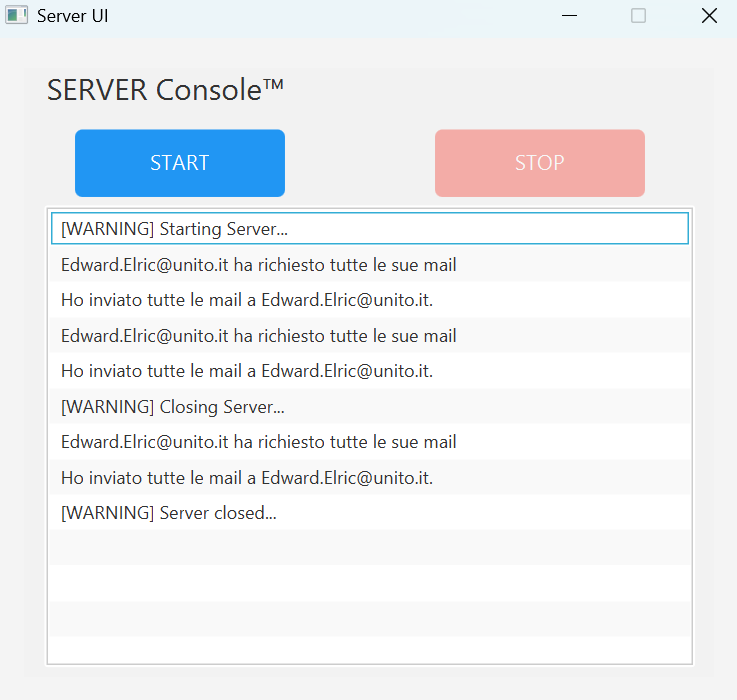
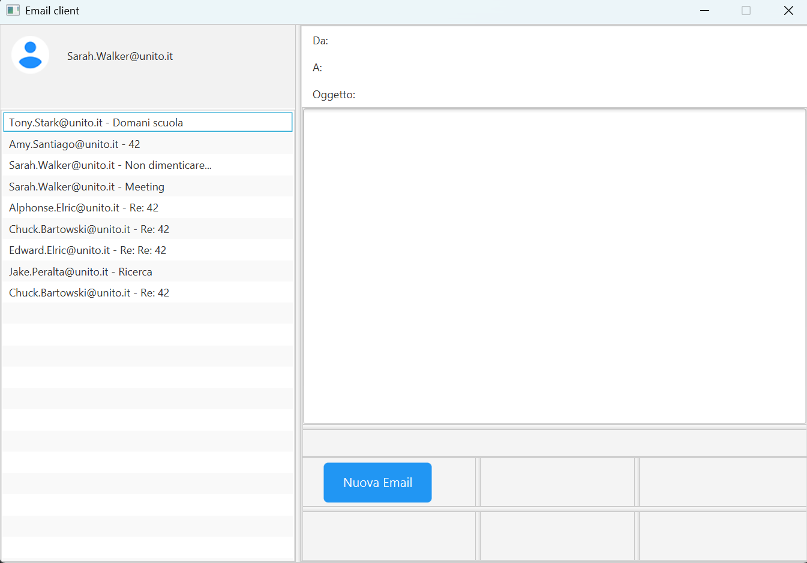
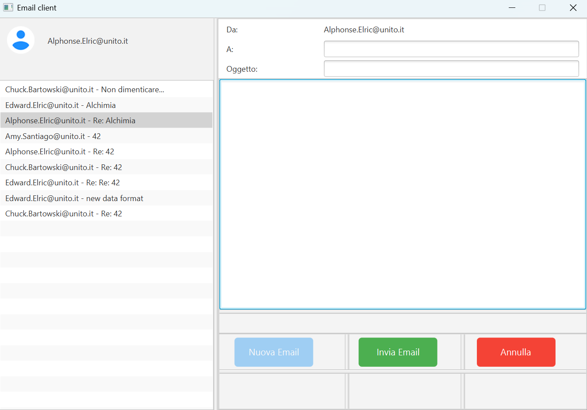
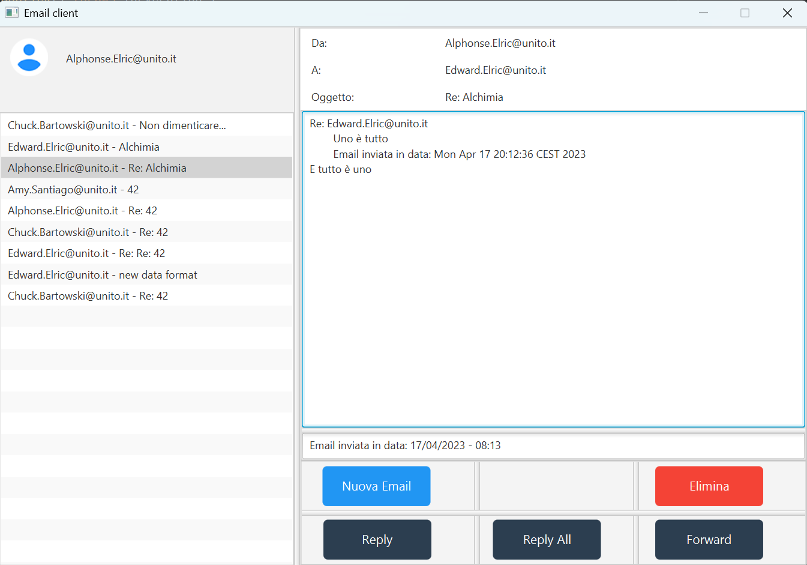

# 📧 Sistema di Posta Elettronica in Java

## Descrizione
Progetto Java distribuito con **Mail Server** e **Mail Client**. Permette di inviare, ricevere, rispondere e inoltrare messaggi tramite interfacce grafiche **JavaFX**.

---

## Struttura del progetto

```
Progetto_Prog3/
├── client/                # Codice e risorse Mail Client
├── server/                # Codice e risorse Mail Server
├── docs/screenshots/      # Screenshot interfacce
├── README.md
└── .gitignore
```

---

## Interfacce principali

**Mail Server**: log di connessioni e azioni dei client, gestione errori.



**Mail Client**: lista messaggi, invio, Reply/Reply All, Forward, rimozione messaggi, notifiche nuove email.

  
  


---

## Requisiti

- Java 17+, JavaFX  
- Architettura MVC + Observer/Observable  
- Persistenza tramite file (txt)  
- Socket TCP per comunicazione client-server  
- Operazioni parallele tramite thread  

---

## Avvio

### Server
```bash
cd server
javac -d bin src/server/*.java
java -cp bin server.MailServer
```

### Client
```bash
cd client
javac -d bin src/client/*.java
java -cp bin client.MailClient
```

> Il client può essere avviato più volte, ciascuno associato a un account diverso, e si connette al server in modo indipendente. Il server gestisce più client in parallelo tramite thread.


---

## Licenza
Distribuito sotto **licenza MIT**. Vedi LICENSE per dettagli.
